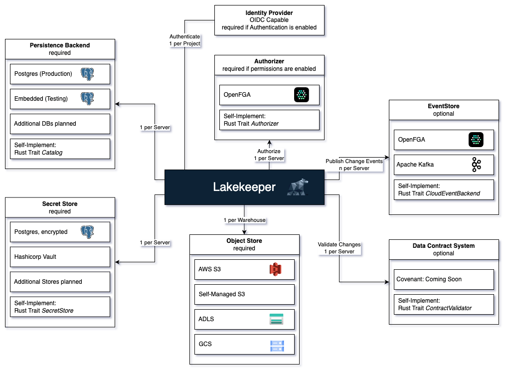

# Lakekeeper

Lakekeeper is a **secure**, **fast** and **easy to use** Apache Iceberg REST Catalog implementation written in Rust.
Start by reading the [quickstart tutorial], then check the [User Guide] for more information.

[quickstart tutorial]: getting-started.md
[User Guide]: user-guide/README.md

<a href="getting-started/" class="btn btn-primary" role="button">Getting Started</a>
<a href="user-guide/" class="btn btn-primary" role="button">User Guide</a>

<h2 class="display-4 text-center">Features</h2>

  

    

      

        <h3 class="card-title"><a href="#architecture">Architecture</a></h3>
        

            Learn more about the way Lakekeeper works. Lakekeeper can support anything from standalone single Project deployments for small companies up to distributed multi-tenant setups.
        

      

    

  

  

    

      

        <h3 class="card-title"><a href="getting-started">Getting Started</a></h3>
        

            Get started quickly with Lakekeeper by using our binary, docker-compose or our helm chart.
        

      

    

  

  

    

      

        <h3 class="card-title"><a href="user-guide">User Guide</a></h3>
        

            Learn how to configure and use Lakekeeper - from configuring a persistent storage backend to connecting your own IdP.
        

      

    

  

  

    

      

        <h3 class="card-title">Host anywhere</h3>
        

            ...
        

      

    

  

---

# Overview

Lakekeeper is an implementation of the Apache Iceberg REST Catalog API. Currently Lakekeeper depends on the following external dependencies:

* **Persistence Backend / Catalog** (required): We currently support only Postgres, but plan to expand our support to more Databases in the future.
* **Warehouse Storage** (required): On creation of a [Warehouse](Todo: Entity Warehouse Link), 
* **Identity Provider** (optional): Lakekeeper can Authenticate incoming requests using any OIDC capable Identity Provider (IdP).
* **Authorization System** (optional): For permission management, Lakekeeper uses the wonderful [OpenFGA](http://openfga.dev) Project. OpenFGA is automatically deployed in our docker-compose and helm installations. Authorization can only be used if Lakekeeper is connected to an Identity Provider.
* **Secret Store** (optional): By default, Lakekeeper stores all secrets (i.e. S3 access credentials) encrypted in the Persistence Backend. To increase security, Lakekeeper can also use external systems to store secrets. Currently all Hashicorp-Vault like stores are supported.
* **Event Store** (optional): Lakekeeper can send Change Events to an Event Store. Currently [Nats](http://nats.io) is supported, we are working on support for [Apache Kafka](http://kafka.apache.org)
* **Data Contract System** (optional): Lakekeeper can interface with external data contract systems to prohibit breaking changes to your tables.

Please check the [User Guide] for information on configuration.

Lakekeeper serves two APIs:

1. The Iceberg REST API is served at endpoints prefixed with `/catalog`. External query engines connect to this API to interact with the catalog. Lakekeeper also implements the S3 remote signing API which is hosted at `/<warehouse-id>/v1/aws/s3/sign`. ToDo: Swagger
1. The Lakekeeper Management API is served at endpoints prefixed with `/management`. It is used to configure Lakekeeper and manage entities that are not part of the Iceberg REST Catalog specification, such as permissions.

## Entity Hierarchy

Entity Hierarchy
In addition to entities defined in the Apache Iceberg specification or the REST specification (Namespaces, Tables, etc.), Lakekeeper introduces new entities for permission management and multi-tenant setups. Below is an overview of all available entities.

### Server
The Server is the highest entity in Lakekeeper, representing a single instance or a cluster of Lakekeeper pods sharing a common state. Each server has a unique identifier (UUID). By default, this `Server ID` is set to `00000000-0000-0000-0000-000000000000`. It can be changed on by setting the `LAKEKEEPER__SERVER_ID` environment variable. We recommend to not set the `Server ID` explicitly, unless multiple Lakekeeper instances share a single Authorization system. The `Server ID` may not be changed after the initial [bootstrapping]()!

### Project
For single-company setups, we recommend using a single Project setup, which is the default. For multi-project/multi-tenant setups, please check our dedicated guide (ToDo: Link). Unless `LAKEKEEPER__ENABLE_DEFAULT_PROJECT` is explicitly set to `false`, a default project is created during [bootstrapping]()! with the nil UUID.

### Warehouse
Each Project can contain multiple Warehouses. Query engines connect to Lakekeeper by specifying a Warehouse name in the connection configuration.

Each Warehouse is associated with a unique location on object stores. Never share locations between Warehouses to ensure no data is leaked via vended credentials. Each Warehouse stores information on how to connect to its location via a `storage-profile` and an optional `storage-credential`.

Warehouses can be configured to use [Soft-Deletes](ToDo: Link). When enabled, tables are not eagerly deleted but kept in a deleted state for a configurable amount of time. During this time, they can be restored. Please find more information on Soft-Deletes [here](ToDo: Link). Please not that Warehouses and Namespaces cannot be deleted via the `/catalog` API while child objects are present. This includes soft-deleted Tables. A cascade-drop API is added in one of the next releases as part of the `/management` API.

### Namespaces
Each Warehouses can contain multiple Namespaces. Namespaces can be nested and serve as containers for Namespaces, Tables and Views. Using the `/catalog` API, a Namespace cannot be dropped unless it is empty. A cascade-drop API is added in one of the next releases as part of the `/management` API.

### Tables & Views
Each Namespace can contain multiple Tables and Views. When creating new Tables and Views, we recommend to not specify the `location` explicitly. If locations are specified explicitly, the location must be a valid sub location of the `storage-profile` of the Warehouse - this is validated by Lakekeeper upon creation. Lakekeeper also ensures that there are no Tables or Views that use a parent- or sub-folder as their `location` and that the location is empty on creation. These checks are required to ensure that no data is leaked via vended-credentials.

### Users
Lakekeeper is no Identity Provider. The identities of users are exclusively managed via an external Identity Provider to ensure compliance with basic security standards. Lakekeeper does not store any Password / Certificates / API Keys or any other secret that grants access to data for users. Instead, we only store Name, Email and type of users with the sole purpose of providing a convenient search while assigning privileges.

Users can be provisioned to lakekeeper by either of the following endpoints:

* Explicit user creation via the POST `/management/user` endpoint. This endpoint is called automatically by the UI upon login. Thus, users are "searchable" after their first login to the UI.
* Implicit on-the-fly creation when calling GET `/catalog/v1/config` (Todo check). This can be used to register technical users simply by connecting to the Lakekeeper with your favorite tool (i.e. Spark). The initial connection will probably fail because privileges are missing to use this endpoint, but the user is provisioned anyway so that privileges can be assigned before re-connecting.

### Roles
Projects can contain multiple Roles, allowing Roles to be reused in all Warehouses within the Project. Roles can be nested arbitrarily. Roles can be provisioned automatically using the `/management/v1/roles` (Todo check) endpoint or manually created via the UI. We are looking into SCIM support to simplify role provisioning. Please consider upvoting the corresponding [Github Issue](https://github.com/lakekeeper/lakekeeper/issues/497) if this would be of interest to you.